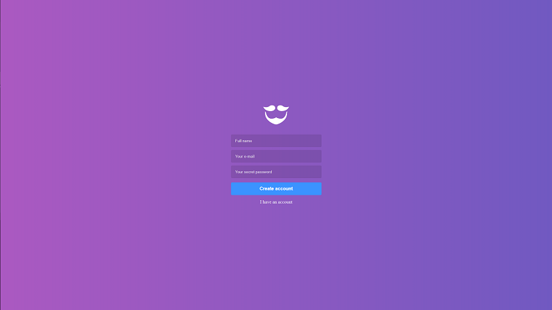
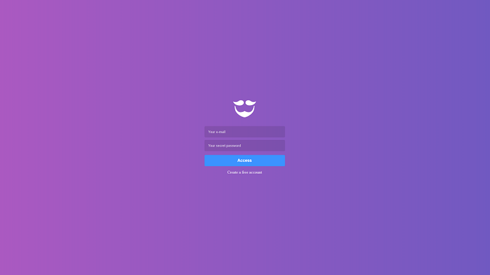
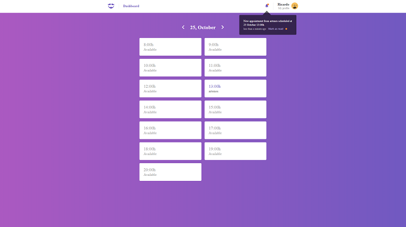
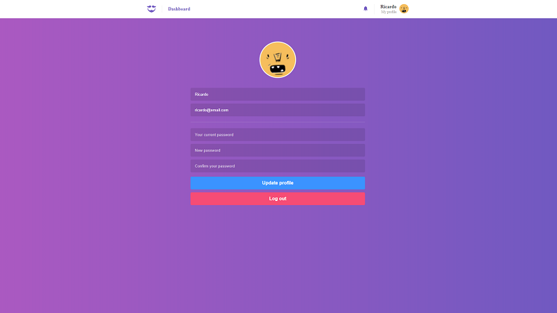

[![Issues][issues-shield]][issues-url]
[![MIT License][license-shield]][license-url]
[![LinkedIn][linkedin-shield]][linkedin-url]

<br />
<p align="center">
  <a href="https://github.com/Artenes/rocketseat-bootcamp-meetapp/tree/master/backend">
    
  </a>

  <h3 align="center">Gobarber (frontend)</h3>

  <p align="center">
    Get in touch with beauty professionals and schedule services!
    <br />
  </p>
</p>

## Table of Contents

* [About the Project](#about-the-project)
  * [Built With](#built-with)
  * [Tooling](#tooling)
* [Getting Started](#getting-started)
  * [Prerequisites](#prerequisites)
  * [Installation](#installation)
* [Usage](#usage)
* [Contributing](#contributing)
* [License](#license)
* [Contact](#contact)

## About The Project

Web application made in React where a provider of beauty services could check its schedule of appointments with clients. This is not a flesh out product to be used in production, it is just a demo application created during [Rocketseat's GoStack bootamp](https://rocketseat.com.br/bootcamp).

### Built With

* [React JS](https://reactjs.org/)
* [Redux](https://redux.js.org/)
* [Redux-Saga](https://redux-saga.js.org/)

### Tooling

* [Reactotron](https://github.com/infinitered/reactotron)
* [Prettier](https://prettier.io/)
* [ESLint](https://eslint.org/)

## Getting Started

To get a local copy up and running follow these steps.

### Prerequisites

* Have the [backend set up](https://github.com/Artenes/rocketseat-bootcamp-gobarber-backend)

### Installation

1. Clone the repo
```sh
git clone git@github.com:Artenes/rocketseat-bootcamp-gobarber-frontend.git
```

2. Access the directory
```sh
cd rocketseat-bootcamp-gobarber-frontend
```

3. Install dependencies
```sh
yarn
```

4. Make sure the backend app is running

5. Run the app
```sh
yarn start
```

## Features

### SignUp
Allows users to create an account.


### SignIn
Allows users to enter in the application.


### Dashborad
Displays a list of appointments and free hours of the provider. It also shows the notifications in the header.


### Profile
Shows user data and allow to edit them.


## Contributing

Contributions are welcome, even though this was made only for learning purposes.

1. Fork the Project
2. Create your Feature Branch (`git checkout -b feature/AmazingFeature`)
3. Commit your Changes (`git commit -m 'Add some AmazingFeature'`)
4. Push to the Branch (`git push origin feature/AmazingFeature`)
5. Open a Pull Request

## License

Distributed under the MIT License. See `LICENSE` for more information.

## Contact

Artenes Nogueira - [artenes.nogueira@gmail.com](mailto:artenes.nogueira@gmail.com)

My blog: [http://artenesbok.com/](http://artenesbok.com/)

My Linkedin: [https://www.linkedin.com/in/artenes/](https://www.linkedin.com/in/artenes/)

README template from: [https://github.com/othneildrew/Best-README-Template](https://github.com/othneildrew/Best-README-Template)

[issues-shield]: https://img.shields.io/github/issues/othneildrew/Best-README-Template.svg?style=flat-square
[issues-url]: https://github.com/othneildrew/Best-README-Template/issues
[license-shield]: https://img.shields.io/github/license/othneildrew/Best-README-Template.svg?style=flat-square
[license-url]: https://github.com/othneildrew/Best-README-Template/blob/master/LICENSE.txt
[linkedin-shield]: https://img.shields.io/badge/-LinkedIn-black.svg?style=flat-square&logo=linkedin&colorB=555
[linkedin-url]: https://www.linkedin.com/in/artenes/
